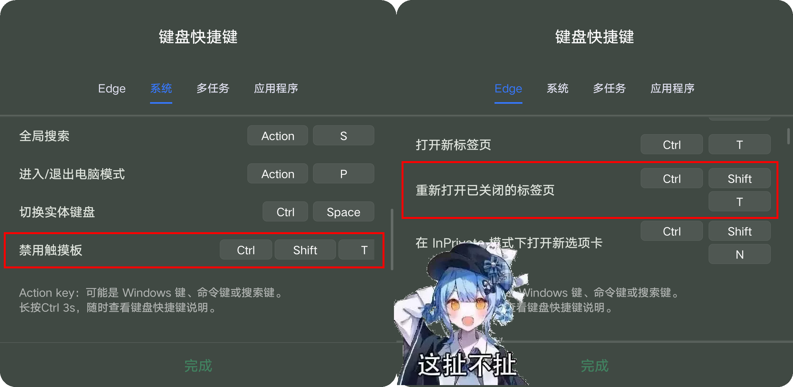

<div align="center">

<h1>BetterZUIKey</h1>

<p></p>
<p>
   简体中文 丨 <b><a href="README_en.md">English</a></b>
</p>

[](https://developer.android.com/about/versions/15) [](https://github.com/LSPosed/LSPosed) [](https://kotlinlang.org) [](LICENSE)

<p>面向联想 ZUXOS 设备的 LSPosed 键盘快捷键覆写模块</p>

</div>

> 君ノ声ヲ　私ガ届ケル
>
> 你的声音，我会为你送达。

**声明**：本仓库中部分代码由 ClaudeAI 生成，可能存在不准确、不完整甚至有缺陷的地方，如果发现任何问题欢迎提交 [Issues](https://github.com/CommandPrompt-Wang/BetterZUIKey/issues) 或 [Pull Request](https://github.com/CommandPrompt-Wang/BetterZUIKey/pulls)。

<p><sub>应用图标来源未知，如有侵权请联系删除</sub></p>

---

## 🤔 为啥做这个？

联想平板的 ZUXOS 中有大量内置键盘快捷键——Win+D 回桌面、Win+Tab 最近任务、Win+P 切换 PC 模式……极大方便了键盘用户的操作习惯，甚至在没有鼠标的情况下也能高效使用平板。

但、不少快捷键根本没有方法被禁用，即使禁用了，系统依旧会吞掉它们。有些快捷键你根本不想用，有些你想换成 AOSP 原生的、没有埋点检测的行为，有些你只是想彻底禁用。



最扯的是，ZUXOS 的快捷键提示也是自相矛盾的，一边在“系统”快捷键里面写着 `Ctrl+Shift+T` 禁用触摸板，一边在 Edge 快捷键里又写着同样的 `Ctrl+Shift+T` 是撤销关闭标签页——它做了 Edge 的适配，但不多

更别提它还将快捷键提示窗在 AOSP 的 `Meta+/` 基础上又加了 `Ctrl+/` ~~敲代码的应该知道这个快捷键被占的意义~~

以及不少私有键无法被市面上的按键映射工具正确识别和映射

BetterZUIKey 是一个 [LSPosed](https://github.com/LSPosed/LSPosed) 模块，通过接管 ZUXOS 的键盘快捷键处理链，允许你在每条快捷键 ~~的屎山分支~~ 上独立选择行为。

## ✨ 功能特性

- **50+ 快捷键独立控制** — Win+字母、Win+功能键、Ctrl/Alt/Shift 组合、ZUXOS 物理键、AOSP 辅助键
  - 部分仍在适配

- **5 种覆写模式** — 保持默认 / 启用 ZUX 实现 / 启用 AOSP 实现 / 关闭（清洗透传前台 app） / 忽略（彻底吞掉）
- **应用模板** — 不同 app 前台时自动切换快捷键配置
- **虚拟 Fn 键** — 用多媒体键模拟 F1~F12，支持键盘 profile 自动编辑、导入导出
- **键盘检测工具** — 内置 scanCode 探测器，帮你映射物理键盘的 Fn 区
- **区域适配** — ROW/CN/KR 区域差异行为的独立覆写
- **AOSP 辅助键** — Win+Alt+3~6 的防抖键/鼠标键/粘滞键/慢速键（Settings.Secure 读写，不走系统 UI）
  - 需要额外授予 root 权限或写入安全设置权限

- ~~**OneVision 开关** — 联想跨屏协作快捷键行为控制~~ （待完成）
- **国际化** — 应用内语言切换，配置变更即时生效

## 📐 层次架构

ZUXOS 的键盘快捷键分发有五层（L0~L4），BetterZUIKey 在其中 4 层都插入了拦截点：

| Layer | Hook Point | Scope |
|-------|-----------|-------|
| **L0** | `KeyboardShortcutController.interceptKeyBeforeQueueing()` | Win+Tab, Win+L, Win+P, Win+Back, Ctrl+Space, Ctrl+Enter, Ctrl+/, Ctrl+Shift+T, FnLock, Win+Alt+3~6 |
| **L1** | `KeyboardShortcutController.interceptKeyBeforeDispatching()` | Win+字母 (S/A/D/I/E/N/M/W/1~8/↑↓), Ctrl+Shift, Alt+Shift |
| **L2** | *(ZUI internal delegate — not hooked)* | Win+I → launchSettings, Meta 单按 → triggerShowAllApps 等。ZUI 内部将部分快捷键委托给 AOSP L3，BetterZUIKey 在 L1 处 strip Meta 后放行即可 |
| **L3** | `PhoneWindowManager.interceptKeyGestureEvent()` | AOSP 原生 gesture（type=1/7/8/12/52/53/201） |
| **L4** | `KeyboardShortcutController.handleKeyGestureEvent()` | ZUI 专属 gesture（type=300/302/305/306/307/308/309/310/311/312） |

这些挂钩在用户界面的表现是，左侧开关等价于系统开关（如果有），右侧下拉框控制实际触发行为。

- 为了保证挂钩触发，建议保持系统开关打开，而在软件内修改触发行为
- ZUXOS 的部分系统开关关闭后，等效于软件的“忽略”，也就是按键会被吞掉

```
Config (SharedPreferences)
    ↕ ContentProvider IPC
system_server (MainHook)
    ├── L0 → L1 → ZUI dispatch → L4
    │                ↕ (PhoneWindowManager)
    │              L3 (AOSP native)
    └── FnKeyManager (virtual Fn + FnLock)
```

## 📦 模块安装

0. **前置条件**：已 root + 安装 [LSPosed](https://github.com/LSPosed/LSPosed)、ZUXOS
   - 当前仅测试 1.5.04 (Android 16)，不确定基于 Android 15 的低版本是否生效
   - 欢迎提交 [Issue](https://github.com/CommandPrompt-Wang/BetterZUIKey/issues) 和 [Pull Request](https://github.com/CommandPrompt-Wang/BetterZUIKey/pulls)
1. 在 [Releases](https://github.com/CommandPrompt-Wang/BetterZUIKey/releases) 下载最新 APK
2. 安装后在 LSPosed Manager 中激活模块（勾选 `system_server` 和 `android`）
3. 重启 system_server（您的 Root 管理器内提供软重启，无需重启设备）
4. 打开应用，主页显示 `✅ Active` 即成功

## 🔧 开发构建

```bash
git clone https://github.com/CommandPrompt-Wang/BetterZUIKey.git
cd BetterZUIKey
./gradlew assembleDebug
# APK at: app/build/outputs/apk/debug/app-debug.apk
```

需要 Android Studio + JDK 17 + Android SDK 34+。
- 模块通过反射调用 Xposed 框架因此本身不依赖任何特定版本的 Xposed API

> **致开发者**：`dev` 分支提交信息以 `[Nightly]` 开头时，CI 会自动触发 Debug 构建并上传 artifact。

## 📖 使用方法

1. **快捷键** — 每条快捷键有一张卡片
   - 左侧开关：系统开关的投射（如果有）
   - 右侧下拉框：覆写模式
   - 点击展开下拉菜单
2. **模板** — 创建针对特定应用的快捷键模板
3. **设置** — 总开关、虚拟 Fn、OneVision、外观、日志级别、区域覆写、语言

其余请阅读内置帮助文档，它位于主页的“帮助”卡片中。

### 覆写模式速查

| 模式 | 效果 |
|------|------|
| **保持默认** | 跟随 ZUXOS 系统开关（开→ZUI，关→透传） |
| **启用 ZUX 实现** | 强制执行 ZUXOS 快捷键行为 |
| **启用 AOSP 实现** | 拦截 ZUXOS，交由 AOSP 原生实现 |
| **关闭** | 不拦截，按键直达前台 app |
| **忽略** | 吞掉按键，系统和 app 都收不到 |

## ⚠️ 免责声明

这是一个 Xposed 模块，直接 hook 系统键盘输入处理链。使用前请：
- **完整阅读 Help 文档**
- 理解每个选项的含义再操作
- 不当配置可能导致部分快捷键行为异常

开发者不承担因使用本模块造成的系统故障、数据丢失或设备异常的任何责任。

## 📂 项目结构

```
app/src/main/java/moe/lovefirefly/betterzuikey/
├── Hook/                    # Xposed 拦截层 (system_server)
│   ├── MainHook.java        # 入口 + 初始化
│   ├── L0Interceptor.java   # pre-queueing
│   ├── L1Interceptor.java   # pre-dispatching
│   ├── L3Interceptor.java   # AOSP gesture
│   ├── L4Interceptor.java   # ZUI gesture
│   ├── FnKeyManager.java    # 虚拟 Fn + FnLock
│   ├── KeyInjector.java     # 按键注入 + 修饰键匹配
│   ├── HookContext.java     # 共享状态 + 配置热重载
│   ├── ConfigIPCManager.java # IPC 通信
│   └── ForegroundTracker.java
├── Config/
│   ├── Config.java          # 主配置数据结构
│   ├── ConfigResolver.java  # 模板解析
│   ├── KeyTemplate.java     # 应用模板数据结构
│   └── PerKeyOverride.java
├── Region/
│   ├── RegionHook.java      # ro.config.lgsi.region 覆写
│   └── FeatureHook.java     # AI 代理 / 区域行为
├── TabsFragments.kt         # 主页 / 快捷键 / 模板 / 设置 tabs
├── ShortcutMeta.kt          # 48 条快捷键的元数据 DSL
├── ModuleStatus.kt          # 模块自检探针
└── ...                      # Activities, Utils, etc.
```

## 📄 许可证

GPL-3.0 © 2025–2026 [CommandPrompt-Wang](https://github.com/CommandPrompt-Wang)
