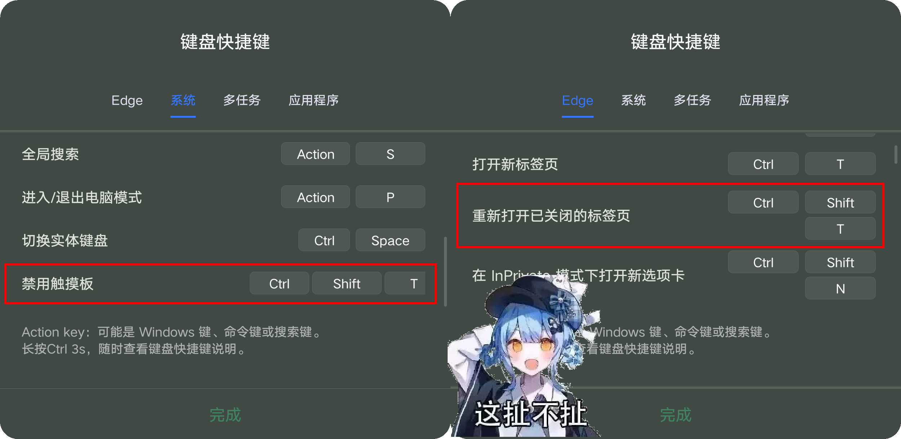
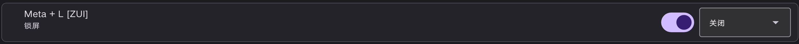

<div align="center">

<h1>BetterZUIKey</h1>

<p></p>
<p>
   简体中文 丨 <b><a href="README_en.md">English</a></b>
</p>

[](https://developer.android.com/about/versions/15) [](https://github.com/LSPosed/LSPosed) [](https://kotlinlang.org) [](https://github.com/CommandPrompt-Wang/BetterZUIKey/releases) [](LICENSE)

<p>面向联想 ZUXOS 设备的 LSPosed 键盘快捷键覆写模块</p>

</div>

> 君ノ声ヲ　私ガ届ケル
>
> 你的声音，我会为你送达。

**声明**：本仓库中部分代码由 ClaudeAI 生成，可能存在不准确、不完整甚至有缺陷的地方，如果发现任何问题欢迎提交 [Issues](https://github.com/CommandPrompt-Wang/BetterZUIKey/issues) 或 [Pull Request](https://github.com/CommandPrompt-Wang/BetterZUIKey/pulls)。

<p><sub>应用图标来源未知，如有侵权请联系删除</sub></p>

---

## 为啥做这个？

联想平板的 ZUXOS 中有大量内置键盘快捷键——Win+D 回桌面、Win+Tab 最近任务、Win+P 切换 PC 模式……极大方便了键盘用户的操作习惯，甚至在没有鼠标的情况下也能高效使用平板。

但、不少快捷键根本没有方法被禁用，即使禁用了，系统依旧会吞掉它们。有些快捷键你根本不想用，有些你想换成 AOSP 原生的、没有埋点检测的行为，有些你只是想彻底禁用。



最扯的是，ZUXOS 的快捷键提示也是自相矛盾的，一边在“系统”快捷键里面写着 `Ctrl+Shift+T` 禁用触摸板，一边在 Edge 快捷键里又写着同样的 `Ctrl+Shift+T` 是撤销关闭标签页——它做了 Edge 的适配，但不多 :D

更别提它还将快捷键提示窗在 AOSP 的 `Meta+/` 基础上又加了 `Ctrl+/` ~~敲代码的应该知道这个快捷键被占的意义~~

以及不少私有键无法被市面上的按键映射工具正确识别和映射

BetterZUIKey 是一个 [LSPosed](https://github.com/LSPosed/LSPosed) 模块，通过接管 ZUXOS 的键盘快捷键处理链，允许你在每条快捷键 ~~的屎山分支~~ 上独立选择行为。

## 功能特性

- **50+ 快捷键独立控制** — Win+字母、Win+功能键、Ctrl/Alt/Shift 组合、ZUXOS 物理键、AOSP 辅助键
- **5 种覆写模式** — 保持默认 / 启用 ZUX 实现 / 启用 AOSP 实现 / 关闭（清洗并透传前台 app） / 忽略（彻底吞掉）
  - 部分快捷键使用独立选项标签（如 Ctrl+Enter 四档：跟随系统 / 插入换行 / 透传 / 忽略）
- **内置更新检查** — 启动时自动检查 / 长按卡片立即检查，四通道可选（自动 / GitHub / GitHub 镜像 / 个人镜像）；发现新版本可在弹窗内查看更新日志
- **应用模板** — 不同 app 前台时自动切换快捷键配置
- **虚拟 Fn 键** — 用顶部多媒体键模拟 F1~F12，支持键盘 profile 自动编辑、导入导出
  - 内置 scanCode 探测器，帮你映射物理键盘的 Fn 区
- **隐藏功能启用** — 无视 ROW/CN/KR 区域差异行为，强制启用 Meta 长按→语音助手 等功能
- **更强的智能键** — 增加「执行命令」功能，内置脚本模板；可与 Termux 集成
- **输入法增强** — 自定义输入法切换 / 输入法语言切换快捷键
  - 切换键可选 Ctrl+Shift / Ctrl+Space / Alt+Shift / 右Alt / 长按 Meta
  - **使用系统框架**：由系统输入法框架接管语言，并**按自定义的语言轮转顺序点名切换**（长按条目进入拖动排序页，每个输入法各自排序）
  - **重映射快捷键**：把按键重映射为该输入法原本的切换键
  - 输入法**内部**行为（标点、配对、提交等）交给各输入法的[组件模块](#组件模块)处理
  - Ctrl+Shift / Alt+Shift 修饰键始终透传，仅在干净释放时触发
- **国际化** — 应用内语言切换，配置变更即时生效

## 组件模块

自 v1.7.0 起，BZK 不再自己 hook 输入法进程（原 DexKit 策略已移除），输入法**内部**的适配拆成各自独立的 LSPosed 模块，便于按各自的节奏适配与更新。

当前已有的模块：

| 模块 | 适用输入法 | 主要内容 |
|------|-----------|----------|
| [Gboard 增强](https://github.com/CommandPrompt-Wang/BetterZUIKey-GboardExt) | Gboard | 严格模式（语言切换只由框架决定）、标点管线、引号 / 括号自动补全、中文态 Enter 不提交 |
| [搜狗输入法联想版增强](https://github.com/CommandPrompt-Wang/BetterZUIKey-SougouOEMExt) | 联想 OEM 版搜狗输入法 | 把语言**暴露为 subtype**、严格模式、标点管线、中文态大写字母、引号 / 括号自动补全 |

用法：在「输入法增强 → 输入法适配管理 → 使用系统框架」里勾上对应输入法，由框架接管语言切换；需要适配的内部行为则由组件模块负责。

## 层次架构

ZUXOS 的键盘快捷键分发有五层（L0~L4），BetterZUIKey 在其中 4 层都插入了拦截点：

| Layer | Hook Point | Scope |
|-------|-----------|-------|
| **L0** | `KeyboardShortcutController.interceptKeyBeforeQueueing()` | Win+Tab, Win+L, Win+P, Win+Back, Ctrl+Space, Ctrl+Enter, Ctrl+/, Ctrl+Shift+T, FnLock, Win+Alt+3~6 |
| **L1** | `KeyboardShortcutController.interceptKeyBeforeDispatching()` | Win+字母 (S/A/D/I/E/N/M/W/1~8/↑↓), Ctrl+Shift, Alt+Shift |
| **L2** | *(ZUI internal delegate — not hooked)* | Win+I → launchSettings, Meta 单按 → triggerShowAllApps 等。ZUI 内部将部分快捷键委托给 AOSP L3，BetterZUIKey 在 L1 处 strip Meta 后放行即可 |
| **L3** | `PhoneWindowManager.interceptKeyGestureEvent()` | AOSP 原生 gesture（type=1/7/8/12/52/53/201） |
| **L4** | `KeyboardShortcutController.handleKeyGestureEvent()` | ZUI 专属 gesture（type=300/302/305/306/307/308/309/310/311/312） |

如果没有特殊说明，这些挂钩在用户界面的表现是，左侧开关等价于系统开关（如果有），右侧下拉框控制实际触发行为。



- 为了保证挂钩触发，建议保持系统开关打开，而在软件内修改触发行为
  - 当修改触发行为时，会自动切换系统开关

- ZUXOS 的部分系统开关关闭后，等效于软件的“忽略”，也就是按键会被吞掉
  - 这也是本插件存在的意义


```
App (Config.json)
    ↕ ContentProvider IPC (ConfigSyncProvider)
system_server (MainHook)
    ├── L0 ⟶ L1 ⟶ L4  (KeyboardShortcutController)
    │         ⬂
    │       L3 (PhoneWindowManager, AOSP native)
    ├── MetaKeyRouter (Win 短按/长按路由)
    ├── FnKeyManager (虚拟 Fn + FnLock)
    └── IMEDispatcher (InputConnection commitText / 按键注入)
```

## 模块安装

0. **前置条件**：~~已 root +~~ 安装 [LSPosed](https://github.com/LSPosed/LSPosed)、ZUXOS
    - 已实现不给 BetterZUIKey 挂载 Root 也能修改系统设置的功能
    - 当前仅测试 1.5.04 (Android 16)，不确定基于 Android 15 的低版本是否生效
    - 欢迎提交 [Issue](https://github.com/CommandPrompt-Wang/BetterZUIKey/issues) 和 [Pull Request](https://github.com/CommandPrompt-Wang/BetterZUIKey/pulls)
1. 在 [Releases](https://github.com/CommandPrompt-Wang/BetterZUIKey/releases) 下载最新 APK
2. 安装后在 LSPosed Manager 中激活模块（勾选 `system_server` 和 `android`）
3. 重启 system_server（您的 Root 管理器内提供软重启，无需重启设备）
4. 打开应用，主页显示 `✅ 已激活` 即成功
   - 你可以忽略缺少 Root 权限的提示
   - 更新后如果遇到作用域错误的提示，除了真的选错了外有可能是 IPC 错误，但强烈建议再重启一次。如果仍不可用，请 [提出issue](https://github.com/CommandPrompt-Wang/BetterZUIKey/issues)

## 开发构建

```bash
git clone https://github.com/CommandPrompt-Wang/BetterZUIKey.git
cd BetterZUIKey
./gradlew assembleDebug
# APK at: app/build/outputs/apk/debug/app-debug.apk
```

需要 Android Studio + JDK 17 + Android SDK 34+。
- ~~模块通过反射调用 Xposed 框架因此本身不依赖任何特定版本的 Xposed API~~
- 需要 [libxposed](https://github.com/libxposed/api) 101 以上的 API

> **致开发者**：`dev` 分支提交信息以 `[Nightly]` 开头时，CI 会自动触发 Debug 构建并上传 artifact。

## 使用方法

1. **快捷键** — 每条快捷键有一张卡片
   - 左侧开关：系统开关的投射（如果有）
   - 右侧下拉框：覆写模式
   - 点击展开下拉菜单
2. **模板** — 创建针对特定应用的快捷键模板
3. **设置** — 总开关、虚拟 Fn、输入法增强、Termux、外观、日志级别、语言
4. **求投喂** — 每个版本首次启动时提示一次；点「此版本不再提示」即跳过该版本，升级到新版本号会再提示一次

其余请阅读内置帮助文档，它位于主页的“帮助”卡片中。

### 覆写模式速查

对于一般的按键：

| 模式 | 效果 |
|------|------|
| **保持默认** | 跟随 ZUXOS 系统开关（开→ZUI，关→透传） |
| **启用 ZUX 实现** | 强制执行 ZUXOS 快捷键行为 |
| **启用 AOSP 实现** | 拦截 ZUXOS，交由 AOSP 原生实现 |
| **关闭** | 不拦截，按键直达前台 app |
| **忽略** | 吞掉按键，系统和 app 都收不到 |

对于两个「智能键」（507/508）：

| 模式 | 短按 | 长按 |
|------|------|------|
| **跟随系统** | 透传 ZUI | 透传 ZUI（系统快捷键设置） |
| **忽略** | 无动作 | 无动作 |
| **执行命令…** | 运行脚本 | 打开命令编辑器 |

长按**卡片**可跳转系统快捷键设置。

- 「Meta 长按」也增加了「执行命令」的功能

对于「Ctrl + Enter」：

| 模式 | 效果 |
|------|------|
| **跟随系统** | 透传，由 ZUI 系统决定 |
| **插入换行** | 拦截 Ctrl+Enter，向应用提交 `\n` 换行符 |
| **透传** | 无条件放行给前台应用 |
| **忽略** | 消费事件，系统和应用都收不到 |

### 语言轮转顺序

用于「使用系统框架」接管语言的输入法：

1. 在「设置 → 输入法增强 → 输入法适配管理 → 使用系统框架」里勾上该输入法
2. **长按**该条目进入「语言轮转顺序」页，拖动排出想要的切换顺序
   - 顺序**按输入法分别保存**；多个 subtype 共用同一语言标签（如搜狗拼音 / 五笔都是 `zh-CN`）也各自独立
   - 「恢复框架顺序」可回到系统原本的顺序
3. 若要轮转多于两门语言，打开页面上的「覆盖默认轮转顺序」
   - 系统框架默认只在**最近使用的 2 门语言**之间轮转，这就是需要该开关的原因

## ⚠️ 免责声明

这是一个 LSPosed 模块，直接 hook 系统键盘输入处理链。使用前请：
- **完整阅读 Help 文档**
- 理解每个选项的含义再操作
- 不当配置可能导致部分快捷键行为异常

开发者不承担因使用本模块造成的系统故障、数据丢失或设备异常的任何责任。

## 项目结构

```
app/src/main/java/moe/lovefirefly/betterzuikey/
├── Hook/                        # Xposed 拦截层 (system_server)
│   ├── MainHook.java            # 入口 + L0~L4 安装 + IME hook 分发
│   ├── L0Interceptor.java         # interceptKeyBeforeQueueing
│   ├── L1Interceptor.java         # interceptKeyBeforeDispatching
│   ├── L3Interceptor.java         # AOSP gesture (PhoneWindowManager)
│   ├── L4Interceptor.java         # ZUI gesture (handleKeyGestureEvent)
│   ├── MetaKeyRouter.java         # Win 短按/长按路由 + 组合键误触修复
│   ├── ZUIKeyHook.java            # 507/508 智能键
│   ├── FnKeyManager.java          # 虚拟 Fn + FnLock
│   ├── HookContext.java           # 共享状态 + 配置热重载 + 智能键命令
│   ├── KeyInjector.java           # 按键注入 + 修饰键匹配
│   ├── ConfigIPCManager.java      # Hook ↔ App IPC
│   ├── ForegroundTracker.java     # 前台 App 跟踪（模板匹配）
│   ├── MetaTrace.java             # 诊断：Meta 键路径追踪（默认关）
│   ├── PassthroughTrace.java      # 诊断：透传路径追踪（默认关）
│   └── HookCompat.java            # libxposed API 兼容封装
├── Config/
│   ├── Config.java                # 主配置 + Gson 持久化
│   ├── ConfigResolver.java        # 全局/模板覆写解析
│   ├── KeyTemplate.java           # 应用模板
│   └── PerKeyOverride.java
├── Region/
│   ├── FeatureHook.java           # AI 代理 / 文件管理器跳转
│   └── RegionProfile.java         # 区域枚举（Config 遗留字段）
├── ime/
│   ├── IMEDispatcher.kt           # IME 切换策略分发（框架 / 重映射）
│   ├── IMEProfile.kt              # Profile 数据结构 + 内置条目
│   ├── IMEProfileManager.kt       # Profile 加载/匹配/持久化
│   └── SubtypeRotation.kt         # 语言轮转顺序（按输入法分别保存）
├── TabsFragments.kt               # 主页 / 快捷键 / 模板 / 设置
├── ShortcutMeta.kt                # 快捷键卡片元数据 DSL
├── IMEAdapterActivity.kt          # 输入法适配管理（两段式）
├── IMESettingsActivity.kt         # 输入法增强设置
├── SubtypeOrderActivity.kt        # 语言轮转顺序拖动排序页
├── UpdateChecker.kt               # 更新检查（GitHub / 个人镜像）+ 更新日志
├── SupportDialog.kt               # 求投喂（每版本一次）
├── ModalDialogGate.kt             # 启动期弹窗串行闸门
├── ConfigSyncProvider.kt          # ContentProvider IPC（App 侧）
├── AppKeyCommand*.kt              # 507/508 / Win 长按 命令执行与编辑
├── TermuxPermission*.kt           # Termux 权限授予
├── ModuleStatus.kt                # 模块自检探针
└── ...                            # Activities、LocaleHelper、Utils 等
```

## 📄 许可证

GPL-3.0 © 2025–2026 [CommandPrompt-Wang](https://github.com/CommandPrompt-Wang)
